::: {.hero}


# gabbro

::: {.tagline}
Seismic processing you can read, fork, and cite.
:::

```{=html}
<div class="install">pip install gabbro</div>
```
:::

[TODO: two sentences on what gabbro actually does and who it's for. Name the
formats it reads, the thing it's faster or clearer at, and the alternative
people are switching from.]

Interested parties can find the project on GitHub at
[github.com/gabbro-ca](https://github.com/gabbro-ca).

## What's in the box {.unnumbered}

[]{.eyebrow}I/O

Reads and writes SEG-Y, SU, and SEG-D without a C toolchain. [TODO]

[]{.eyebrow}Processing

[TODO: the actual flows. Deconvolution, NMO, stacking, migration, whatever
you've built.]

[]{.eyebrow}Provenance

Every flow is a script, so a stack is reproducible from raw field data. [TODO]

## Try it {.unnumbered}

```python
import gabbro as gb

shot = gb.read_segy("line-42.sgy")
gathers = shot.sort("cdp").nmo(velocity=gb.velocity.from_picks("picks.csv"))
stack = gathers.stack()
stack.plot()
```

[The section at the top of this page is a synthetic gather: six dipping
reflectors convolved with a 26 Hz Ricker wavelet, plotted variable-area. The
script that made it lives in [`assets/make_hero.py`](https://github.com/gabbro-ca/gabbro).]{.text-muted}
